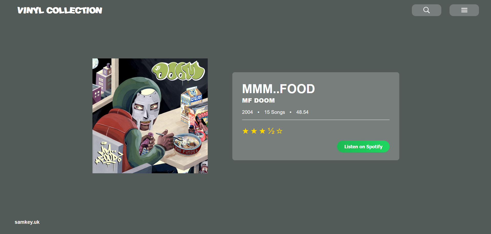

# VinylCollection



A Blazor Server (.NET 8) web application for managing a vinyl collection.

## Project Structure
- `FRONTEND/` - Blazor Server app (.NET 8)

## Prerequisites
- [.NET 8 SDK](https://dotnet.microsoft.com/en-us/download/dotnet/8.0)

## Running the App (Development)
From the `FRONTEND` directory:

```bash
cd FRONTEND
 dotnet watch run
```

- The app will be available at [http://localhost:5000](http://localhost:5000) by default (or as specified in launch settings).

### Hot Reload
- Uses `dotnet watch run` for live reload on code changes.

## Stopping the App
Press `Ctrl+C` in the terminal to stop the development server.

## Notes
- For production, publish the app using `dotnet publish` and deploy as needed. 